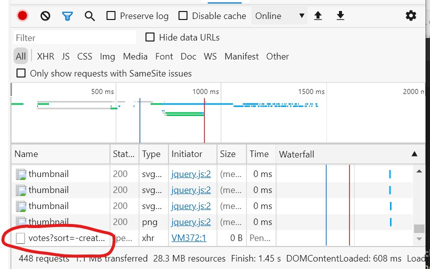
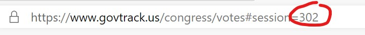

# Download

The origional links and vote tallies _can_ be downloaded by hand from [govtrack.us](https://www.govtrack.us).
The origional bill text _can_ be downloaded by hand from [congress.gov](https://www.congress.gov).
For convience, we keep a 2nd copy of all the data gzip'ed in [releases][releases].
We need to source the data localy for everyone because GitHub has storage limits that we don't want to cross.

## Steps

1. Retrieve the bill list _by hand_.
   This is because the [robots.txt](https://www.govtrack.us/robots.txt) forbids just enough that the full process can not be automated.
   Screenshots below.
   1. Open up Chrome, navigate to [congres votes](https://www.govtrack.us/congress/votes) link, then the dev tools, then look for `votes?sort=`.
   2. Right click, copy, then copy response.
   3. Paste the result into notepad and save as `~/data/list_of_bills/{session number}.json`.
2. Convert the raw result into a list of urls.
   [Code instructions](../code) (script 1)
3. Get the vote tally and bill text.
   [Code instructions](../code) (script 2)

## Shortcuts

[GitHub](https://github.com) has some issues when dealing with [large files](https://help.github.com/en/articles/working-with-large-files).
The [recomended method](https://help.github.com/en/articles/distributing-large-binaries) for dealing with large files is to store them in [releases][releases].
You can find the gzip'ed versions of the below there.
Any of the steps can be skipped by downloading the correct file from [releases][releases] and proceding from that point forward.

* List of bills
* Vote tally
* Bill text

## Screenshots

[releases]: https://github.com/MindMimicLabs/classification-congressional-votes/releases
